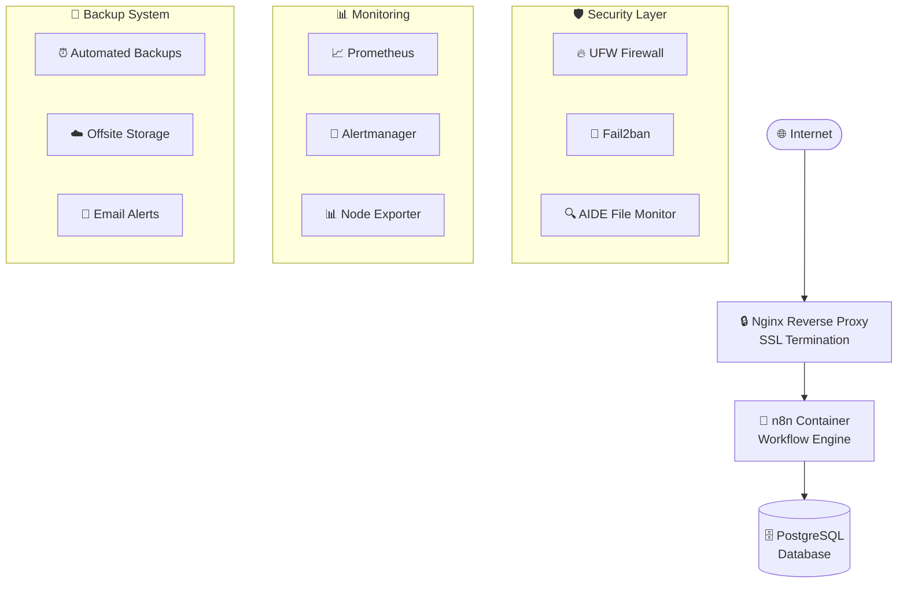

# 🚀 n8n Production Deployment with Ansible

<div align="center">


[](https://www.ansible.com/)
[](https://www.docker.com/)
[](https://n8n.io/)
[](https://ubuntu.com/)

```
├── 🎭 roles/                  # Modular components
│   ├── 💾 backup/            # Automated backups & rotation
│   ├── 🌐 dns_locale/        # DNS records & localization
│   ├── 🐳 docker/            # Docker engine & security
│   ├── 🔥 hardening/         # Security hardening (UFW, Fail2ban, AIDE)
│   ├── 📊 monitoring/        # Prometheus stack & alerting
│   ├── 🤖 n8n/               # n8n workflow engine
│   ├── 🌐 nginx/             # Nginx web server configuration
│   ├── 📧 postfix/           # Email relay for notifications
│   ├── 🗄️ postgresql/        # Database backend
│   ├── 🔒 reverse_proxy/     # Reverse proxy & SSL automation
│   ├── 🔄 system_update/     # OS updates & SSH hardening
│   └── 👥 user_access/       # User management & SSH keys
├── 📚 docs/                  # Comprehensive documentation
```

**📈 [Complete Monitoring Guide](docs/02_roles/monitoring.md)** ← **Set up enterprise monitoring**

- **📈 Secure Web Access**: Prometheus and Alertmanager via HTTPS subdomains ([Setup Guide](docs/02_roles/monitoring.md))
- **🔐 Basic Authentication**: Password-protected monitoring interfaces ([Security](docs/02_roles/monitoring.md))
- **📧 Smart Alerting**: Email notifications for system issues ([Email Setup](docs/02_roles/postfix.md))
- **📋 Log Aggregation**: Optional ELK/Loki integration ([Advanced Config](docs/02_roles/monitoring.md))
- **🎯 n8n Specific**: Workflow health, performance metrics ([n8n Monitoring](docs/02_roles/n8n.md))
- **🔒 Firewall Protected**: Direct port access blocked, only HTTPS access ([Security](docs/02_roles/hardening.md))s://img.shields.io/badge/Docker-2496ED?style=for-the-badge&logo=docker&logoColor=white)](https://www.docker.com/)
[](https://n8n.io/)
[](https://ubuntu.com/)

**🎯 Production-Ready | 🔒 Security-Hardened | 🧩 Modular | 📚 Fully Documented**

</div>

---

## 🌟 What is This?

**The most comprehensive, production-ready Ansible automation for deploying n8n workflows!** 

This project transforms your Ubuntu 24.04 server into a bulletproof n8n automation platform with enterprise-grade security, monitoring, backups, and best practices baked in.

### ✨ Why Choose This Deployment?

- 🎛️ **Fully Automated**: One command deploys everything
- 🔐 **Security First**: Hardening, firewalls, SSL, intrusion detection
- 📊 **Enterprise Monitoring**: Prometheus, Alertmanager, log aggregation
- 💾 **Bulletproof Backups**: Automated with notifications and rotation
- 🧩 **Modular Design**: Pick and choose components
- 📖 **Documentation Rich**: Every step explained with examples
- 🧪 **Test-Driven**: Molecule testing and CI/CD ready

---

## 🏗️ Architecture Overview



---

## 🚀 Quick Start (5 Minutes to Production!)

### 1️⃣ Pre-Flight Checklist ✅

**📋 [Complete Checklist](docs/01_getting_started/CHECKLIST.md)** ← **Start here for step-by-step setup!**

```bash
# Clone this repository
git clone https://github.com/majidka99/n8n.git
cd n8n

# Copy example configurations
cp group_vars/vars.example.yml group_vars/vars.yml
cp group_vars/vault.example.yml group_vars/vault.yml
```

**⚠️ CRITICAL**: Before proceeding, complete these essential steps from our [Pre-Flight Checklist](docs/01_getting_started/CHECKLIST.md):

- ✅ **Domain & DNS Setup**: Configure your domains and DNS records
- ✅ **Email Configuration**: Set up admin emails and SMTP relay
- ✅ **Secrets Management**: Update ALL passwords in vault.yml
- ✅ **Monitoring Subdomains**: Create DNS records for Prometheus/Alertmanager
- ✅ **SSL Certificates**: Ensure domains are reachable for Let's Encrypt

### 2️⃣ Customize Your Deployment 🎯

**📖 [Variables & Vault Guide](docs/01_getting_started/USING_VARS_AND_VAULT.md)** ← **Learn about configuration options**

Edit `group_vars/vars.yml`:
```yaml
n8n_domain: "your-n8n.domain.com"
n8n_admin_email: "admin@yourdomain.com"
n8n_public_ip: "YOUR.SERVER.IP.HERE"
reverse_proxy_type: "nginx"
```

### 3️⃣ Secure Your Secrets 🔐

**🔐 [Vault Management Guide](docs/01_getting_started/USING_VARS_AND_VAULT.md)** ← **Essential security setup**

```bash
# Set vault password
echo "your-strong-vault-password" > .vault_pass.txt
chmod 600 .vault_pass.txt

# Edit encrypted secrets
ansible-vault edit --vault-password-file .vault_pass.txt group_vars/vault.yml
```

### 4️⃣ Deploy! 🚀

```bash
ansible-playbook -i inventory/hosts playbooks/main.yml --vault-password-file .vault_pass.txt
```

**🎉 That's it! Your n8n instance is now live with enterprise-grade infrastructure!**

---

## 📁 Project Structure

```
📦 n8n/
├── 📄 README.md               # This comprehensive guide
├── ⚙️ ansible.cfg             # Ansible configuration
├── 📋 inventory/
│   └── hosts                  # Target servers configuration
├── 🎛️ group_vars/             # Configuration & secrets
│   ├── vars.yml               # Non-secret configuration
│   ├── vault.yml              # Encrypted secrets (Ansible Vault)
│   ├── vars.example.yml       # Template configuration
│   └── vault.example.yml      # Template secrets
├── 🎭 roles/                  # Modular components
│   ├── 🔄 backup/            # Automated backups & rotation
│   ├── 🌐 dns_locale/        # DNS records & localization
│   ├── 🐳 docker/            # Docker engine & security
│   ├── � hardening/         # Security hardening (UFW, Fail2ban, AIDE)
│   ├── 📊 monitoring/        # Prometheus stack & alerting
│   ├── 🤖 n8n/               # n8n workflow engine
│   ├── 🔒 reverse_proxy/     # Nginx + SSL automation
│   ├── � postfix/           # Email relay for notifications
│   ├── 🗄️ postgresql/        # Database backend
│   ├── � system_update/     # OS updates & SSH hardening
│   └── � user_access/       # User management & SSH keys
├── � docs/                  # Comprehensive documentation
│   ├── 01_getting_started/   # Setup guides & checklists
│   ├── 02_roles/             # Individual role documentation
│   └── 03_tests/             # Testing & quality guides
├── 🧪 molecule/              # Testing framework
│   └── default/              # Default test scenario
├── 🛠️ playbooks/             # Main deployment playbooks
│   └── main.yml              # Primary deployment playbook
└── 📄 LICENSE                # MIT License
```

---

## 🎛️ Component Roles

**📚 [Complete Role Documentation](docs/02_roles/)** ← **Detailed configuration for each component**

| Role | Purpose | Key Features | Documentation |
|------|---------|-------------|---------------|
| 🔄 **system_update** | OS baseline | Package updates, SSH hardening, snapshots | [📖 Guide](docs/02_roles/system_update.md) |
| 👥 **user_access** | User management | SSH keys, sudo access, secure defaults | [📖 Guide](docs/02_roles/user_access.md) |
| 🐳 **docker** | Container platform | Docker CE, hardened config, n8n containers | [📖 Guide](docs/02_roles/docker.md) |
| 🗄️ **postgresql** | Database | Secure PostgreSQL for n8n data | [📖 Guide](docs/02_roles/postgresql.md) |
| 🤖 **n8n** | Workflow engine | n8n deployment with optimal configuration | [📖 Guide](docs/02_roles/n8n.md) |
| 🌐 **nginx** | Web server | Nginx web server configuration | [📖 Guide](docs/02_roles/nginx.md) |
| 🔒 **reverse_proxy** | Web gateway | Reverse proxy, SSL automation, security headers | [📖 Guide](docs/02_roles/reverse_proxy.md) |
| 💾 **backup** | Data protection | Automated backups, rotation, offsite storage | [📖 Guide](docs/02_roles/backup.md) |
| 🔥 **hardening** | Security | Fail2ban, AIDE, ModSecurity, auditing | [📖 Guide](docs/02_roles/hardening.md) |
| 📊 **monitoring** | Observability | Prometheus, Alertmanager, dashboards | [📖 Guide](docs/02_roles/monitoring.md) |
| 📧 **postfix** | Email relay | SMTP relay for notifications and alerts | [📖 Guide](docs/02_roles/postfix.md) |
| 🌐 **dns_locale** | Environment | DNS records, timezone, localization | [📖 Guide](docs/02_roles/dns_locale.md) |

---

## 🎯 Smart Deployment Options

### 🎲 Deploy Everything (Recommended)
```bash
ansible-playbook -i inventory/hosts playbooks/main.yml --vault-password-file .vault_pass.txt
```

### 🎮 Selective Deployment
```bash
# Only security and monitoring
ansible-playbook -i inventory/hosts playbooks/main.yml --tags "hardening,monitoring" --vault-password-file .vault_pass.txt

# Skip backups for testing
ansible-playbook -i inventory/hosts playbooks/main.yml --skip-tags "backup" --vault-password-file .vault_pass.txt
```

### 🔍 Dry Run (See What Would Change)
```bash
ansible-playbook -i inventory/hosts playbooks/main.yml --check --diff --vault-password-file .vault_pass.txt
```

---

## 🛡️ Security Features

**🔒 [Complete Security Guide](docs/02_roles/hardening.md)** ← **Deep dive into security implementation**

- **🔥 Multi-layer Firewall**: UFW + Fail2ban + rate limiting ([Guide](docs/02_roles/hardening.md))
- **🔐 SSL Everywhere**: Automated Let's Encrypt certificates ([Guide](docs/02_roles/reverse_proxy.md))
- **🔍 Intrusion Detection**: AIDE file integrity monitoring ([Guide](docs/02_roles/hardening.md))
- **🚫 Attack Prevention**: ModSecurity WAF rules ([Guide](docs/02_roles/hardening.md))
- **🔑 SSH Hardening**: Key-only auth, non-standard ports ([Guide](docs/02_roles/system_update.md))
- **🧱 Container Security**: Docker security benchmarks ([Guide](docs/02_roles/docker.md))
- **📊 Security Auditing**: Automated vulnerability scans ([Guide](docs/02_roles/hardening.md))

---

## 📊 Monitoring & Alerting

- **📈 Secure Web Access**: Prometheus and Alertmanager via HTTPS subdomains
- **� Basic Authentication**: Password-protected monitoring interfaces
- **📧 Smart Alerting**: Email notifications for system issues
- **📋 Log Aggregation**: Optional ELK/Loki integration
- **🎯 n8n Specific**: Workflow health, performance metrics
- **🔒 Firewall Protected**: Direct port access blocked, only HTTPS access

---

## 💾 Backup Strategy

**💾 [Complete Backup Guide](docs/02_roles/backup.md)** ← **Protect your data**

- **⏰ Automated Schedules**: Daily backups with retention ([Configuration](docs/02_roles/backup.md))
- **📧 Email Notifications**: Success/failure alerts ([Setup](docs/02_roles/postfix.md))
- **☁️ Offsite Storage**: Optional cloud sync with Rclone ([Cloud Setup](docs/02_roles/backup.md))
- **🔄 Full Stack Backup**: Database, configs, n8n data ([Complete Guide](docs/02_roles/backup.md))
- **📋 Backup Verification**: Automated integrity checks ([Validation](docs/02_roles/backup.md))

---

## 🧪 Testing & Quality

**🧪 [Complete Testing Guide](docs/03_tests/TESTING_AND_LINTING.md)** ← **Learn testing workflows**

### Run Tests Locally
```bash
# Lint everything
ansible-lint

# Test individual roles
cd molecule/default
molecule test

# Full integration test
molecule test --all
```

### CI/CD Ready
- **GitHub Actions**: Automated testing on PRs
- **Multi-environment**: Dev/staging/production configs
- **Quality Gates**: Linting, testing, security scans

---

## 📚 Documentation Deep Dive

**📖 [Complete Documentation Portal](docs/)** ← **Everything you need to know**

| Guide | What's Inside | Quick Access |
|-------|---------------|--------------|
| 📋 **[Getting Started](docs/01_getting_started/)** | Pre-flight checklist, setup guide | [📝 Checklist](docs/01_getting_started/CHECKLIST.md) |
| 🎭 **[Role Documentation](docs/02_roles/)** | Detailed role configurations | [🔍 All Roles](docs/02_roles/) |
| 🧪 **[Testing Guide](docs/03_tests/)** | Molecule, linting, dry-runs | [🧪 Testing](docs/03_tests/TESTING_AND_LINTING.md) |
| 🔐 **[Vault & Variables](docs/01_getting_started/USING_VARS_AND_VAULT.md)** | Secrets management | [🔐 Security](docs/01_getting_started/USING_VARS_AND_VAULT.md) |
| 🗺️ **[Project Roadmap](docs/01_getting_started/BLUEPRINT_ROADMAP.md)** | Architecture & future plans | [🚀 Roadmap](docs/01_getting_started/BLUEPRINT_ROADMAP.md) |

---

## 🔧 Advanced Configuration

### Custom n8n Configuration
```yaml
# In group_vars/vars.yml
n8n_image_tag: "1.103.2"
n8n_log_level: "info"
monitoring_enable_n8n_logging: true
n8n_log_output: "console,file"
```

### High Availability Setup
```yaml
# Multiple instances
postgresql_backup_dir: "/shared/backups"
backup_offsite_enabled: true
monitoring_enable_log_shipper: true
```

### Custom Monitoring Access
```yaml
# Secure monitoring subdomains
monitoring_prometheus_domain: "prometheus.yourdomain.com"
monitoring_alertmanager_domain: "alerts.yourdomain.com"
monitoring_enable_nginx_proxy: true
monitoring_enable_basic_auth: true
```

---

## 🤝 Contributing

We love contributions! Here's how to get involved:

1. **🍴 Fork** this repository
2. **🌿 Branch** from `main`: `git checkout -b feature/amazing-feature`
3. **🧪 Test** your changes: `ansible-lint && molecule test`
4. **📝 Document** your changes in `docs/`
5. **🚀 Submit** a pull request

### 🎯 Contribution Ideas
- 📦 New integration roles (Grafana, Jenkins, etc.)
- 🔧 Platform support (CentOS, Debian)
- 🧪 Additional test scenarios
- 📚 Documentation improvements
- 🛡️ Security enhancements

---

## 🙋 Getting Help

- 📖 **Read the Docs**: Start with `docs/01_getting_started/`
- 🐛 **Report Issues**: Use GitHub Issues with detailed info
- 💬 **Discussions**: GitHub Discussions for questions
- 📧 **Email**: For sensitive security issues

---

## 📝 Author & Credits

**Created with ❤️ by:**

- **👨‍💻 Majid Wachtarczyk**
- **📧 jabawookez99@hotmail.com**
- **🐙 GitHub: [@majidka99](https://github.com/majidka99)**
- **📱 +4915252003187**
- **📅 Created: August 2, 2025**

*Special thanks to the n8n community and all the amazing open-source tools that make this possible!*

---

## ✅ Essential Pre-Deployment Checklist

**📋 [Complete Interactive Checklist](docs/01_getting_started/CHECKLIST.md)** ← **Use this comprehensive guide!**

Before running the deployment, ensure you've completed these critical steps:

### 🌐 Domain & Infrastructure
- [ ] **Domain Names**: Configure real domains (replace all example.com entries)
- [ ] **DNS Records**: Create A records for main domain and monitoring subdomains
- [ ] **Public IP**: Set your server's public IP in configuration
- [ ] **SSL Prerequisites**: Ensure domains resolve for Let's Encrypt validation

### 📧 Email & Notifications  
- [ ] **Admin Emails**: Update all admin email addresses
- [ ] **SMTP Relay**: Configure Gmail App Password for notifications
- [ ] **DKIM Keys**: Generate and configure DKIM for email security
- [ ] **Monitoring Alerts**: Set up email destinations for system alerts

### 🔐 Security & Secrets
- [ ] **Vault Password**: Create strong vault password file
- [ ] **Database Passwords**: Update ALL passwords in vault.yml
- [ ] **Basic Auth**: Set monitoring interface passwords
- [ ] **SSH Keys**: Configure SSH access for deployment user
- [ ] **System Users**: Set secure passwords for system accounts

### 📊 Monitoring & Subdomains
- [ ] **Monitoring Domains**: Configure prometheus.yourdomain.com, alerts.yourdomain.com
- [ ] **SSL Certificates**: Enable automatic SSL for monitoring interfaces
- [ ] **Basic Authentication**: Secure monitoring access with passwords
- [ ] **Firewall Rules**: Configure UFW to block direct port access

**📖 [See Complete Checklist](docs/01_getting_started/CHECKLIST.md) for detailed instructions on each item.**

---

## 🏗️ Architecture Overview

---

## 📜 License

This project is licensed under the MIT License - see the [LICENSE](LICENSE) file for details.

---

<div align="center">

**⭐ If this project helped you, please give it a star! ⭐**

**🚀 Ready to deploy? Follow the [Quick Start](#-quick-start-5-minutes-to-production) guide!**

### 📖 Quick Reference Links

| 📋 [Checklist](docs/01_getting_started/CHECKLIST.md) | 🔐 [Vault Guide](docs/01_getting_started/USING_VARS_AND_VAULT.md) | 🎭 [Roles](docs/02_roles/) | 🧪 [Testing](docs/03_tests/TESTING_AND_LINTING.md) |
|:---:|:---:|:---:|:---:|

</div>